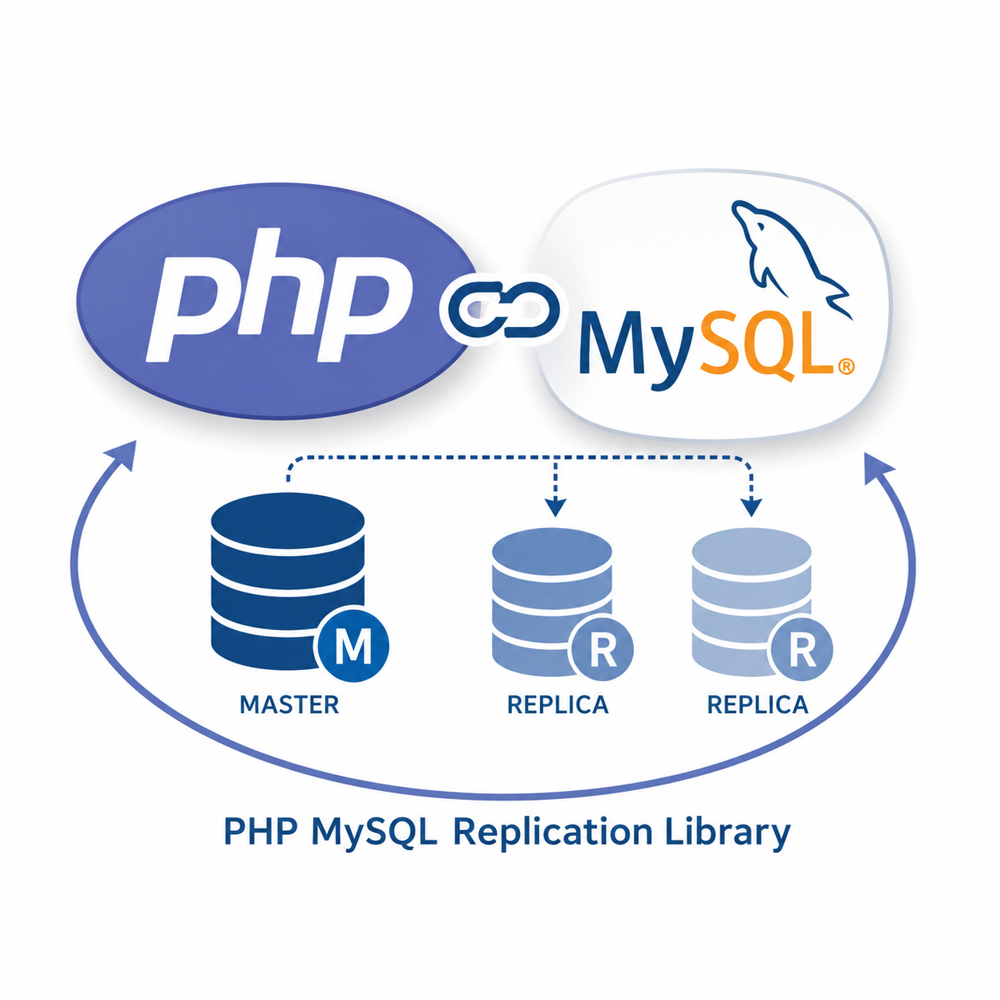

<p align="center">
  
</p>

<h1 align="center">php-mysql-replication</h1>

<p align="center">
  Pure PHP implementation of the MySQL replication protocol — stream <code>insert</code>, <code>update</code> and <code>delete</code> events (with data and raw SQL) straight from the binlog.
</p>

<p align="center">
  <a href="https://packagist.org/packages/krowinski/php-mysql-replication"></a>
  <a href="https://packagist.org/packages/krowinski/php-mysql-replication"></a>
  <a href="https://packagist.org/packages/krowinski/php-mysql-replication"></a>
</p>

Based on the great work of https://github.com/noplay/python-mysql-replication and https://github.com/fengxiangyun/mysql-replication.

---

## 📖 Table of contents

- [Installation](#-installation)
- [Compatibility](#-compatibility-based-on-integration-tests)
- [MySQL server settings](#-mysql-server-settings)
- [Configuration](#-configuration)
- [Examples](#-examples)
- [Benchmarks](#-benchmarks)
- [Similar projects](#-similar-projects)
- [FAQ](#-faq)

## 🚀 Installation

In your project:

```sh
composer require krowinski/php-mysql-replication
```

or standalone:

```sh
git clone https://github.com/krowinski/php-mysql-replication.git

composer install -o
```

## ✅ Compatibility (based on integration tests)

**PHP**

- php 8.2
- php 8.3
- php 8.4
- php 8.5

**MySQL**

- mysql 5.5
- mysql 5.6
- mysql 5.7
- mysql 8.0 (`mysql_native_password` and `caching_sha2_password` supported)
- mariadb 5.5
- mariadb 10.0
- mariadb 10.1
- probably percona versions as it's based on native mysql

## ⚙️ MySQL server settings

In your MySQL server configuration file you need to enable replication:

```ini
[mysqld]
server-id        = 1
log_bin          = /var/log/mysql/mysql-bin.log
expire_logs_days = 10
max_binlog_size  = 100M
binlog-format    = row # Very important if you want to receive write, update and delete row events
```

MySQL replication events explained: https://dev.mysql.com/doc/internals/en/event-meanings.html

MySQL user privileges:

```sql
GRANT REPLICATION SLAVE, REPLICATION CLIENT ON *.* TO 'user'@'host';

GRANT SELECT ON `dbName`.* TO 'user'@'host';
```

## 🔧 Configuration

Use `ConfigBuilder` or `ConfigFactory` to create configuration.

| Option | Description |
|---|---|
| `user` | your mysql user (**mandatory**) |
| `ip` / `host` | your mysql host/ip (**mandatory**) |
| `password` | your mysql password (**mandatory**) |
| `port` | your mysql host port (default `3306`) |
| `charset` | db connection charset (default `utf8`) |
| `gtid` | GTID marker(s) to start from (format `9b1c8d18-2a76-11e5-a26b-000c2976f3f3:1-177592`) |
| `mariaDbGtid` | MariaDB GTID marker(s) to start from (format `1-1-3,0-1-88`) |
| `slaveId` | script slave id for identification (default `666`) (`SHOW SLAVE HOSTS`) |
| `binLogFileName` | bin log file name to start from |
| `binLogPosition` | bin log position to start from |
| `eventsOnly` | array to only listen on given events (full list in [ConstEventType.php](https://github.com/krowinski/php-mysql-replication/blob/master/src/MySQLReplication/Definitions/ConstEventType.php)) |
| `eventsIgnore` | array of events to ignore (full list in [ConstEventType.php](https://github.com/krowinski/php-mysql-replication/blob/master/src/MySQLReplication/Definitions/ConstEventType.php)) |
| `tablesOnly` | array to only listen on given tables (default all tables) |
| `databasesOnly` | array to only listen on given databases (default all databases) |
| `tablesRegex` | array of regex patterns to only listen on matching tables (default all tables) |
| `databasesRegex` | array of regex patterns to only listen on matching databases (default all databases) |
| `tableCacheSize` | some data is collected from the information schema; this data is cached |
| `custom` | if some params must be set in extended/implemented own classes |
| `heartbeatPeriod` | interval in seconds between replication heartbeats. Whenever the master's binary log is updated with an event, the waiting period for the next heartbeat is reset. Range `0`–`4294967` seconds with millisecond resolution (smallest nonzero value `0.001`). Heartbeats are sent by the master only if there are no unsent events in the binary log for longer than this interval |
| `slaveUuid` | sets slave uuid for identification (default `0015d2b6-8a06-4e5e-8c07-206ef3fbd274`) |
| `gtidAutoPosition` | enables GTID auto positioning, letting the master decide where to start streaming from based on the GTID set already processed (default `false`) |
| `semiSync` | opt in to semi-sync replication. If the master doesn't have `rpl_semi_sync_master_enabled`/`rpl_semi_sync_source_enabled` = `ON`, this is silently ignored and the connection falls back to async replication (default `false`) |

## 💡 Examples

All examples are available in the [examples directory](https://github.com/krowinski/php-mysql-replication/tree/master/example).

This example will dump all replication events to the console.

> Remember to change the config for your user, host and password.
> The user should have replication privileges [`REPLICATION CLIENT`, `SELECT`].

```sh
php example/dump_events.php
```

Test SQL events:

```sql
CREATE DATABASE php_mysql_replication;
use php_mysql_replication;
CREATE TABLE test4 (id int NOT NULL AUTO_INCREMENT, data VARCHAR(255), data2 VARCHAR(255), PRIMARY KEY(id));
INSERT INTO test4 (data,data2) VALUES ("Hello", "World");
UPDATE test4 SET data = "World", data2="Hello" WHERE id = 1;
DELETE FROM test4 WHERE id = 1;
```

<details>
<summary>Output (depends on configuration, e.g. GTID off/on) — click to expand</summary>

```
=== Event format description ===
Date: 2017-07-06T13:31:11+00:00
Log position: 0
Event size: 116
Memory usage 2.4 MB

=== Event gtid ===
Date: 2017-07-06T15:23:44+00:00
Log position: 57803092
Event size: 48
Commit: true
GTID NEXT: 3403c535-624f-11e7-9940-0800275713ee:13675
Memory usage 2.42 MB

=== Event query ===
Date: 2017-07-06T15:23:44+00:00
Log position: 57803237
Event size: 145
Database: php_mysql_replication
Execution time: 0
Query: CREATE DATABASE php_mysql_replication
Memory usage 2.45 MB

=== Event query ===
Date: 2017-07-06T15:23:44+00:00
Log position: 57803500
Event size: 215
Database: php_mysql_replication
Execution time: 0
Query: CREATE TABLE test4 (id int NOT NULL AUTO_INCREMENT, data VARCHAR(255), data2 VARCHAR(255), PRIMARY KEY(id))
Memory usage 2.45 MB

=== Event query ===
Date: 2017-07-06T15:23:44+00:00
Log position: 57803637
Event size: 89
Database: php_mysql_replication
Execution time: 0
Query: BEGIN
Memory usage 2.45 MB

=== Event tableMap ===
Date: 2017-07-06T15:23:44+00:00
Log position: 57803708
Event size: 71
Table: test4
Database: php_mysql_replication
Table Id: 866
Columns amount: 3
Memory usage 2.71 MB

=== Event write ===
Date: 2017-07-06T15:23:44+00:00
Log position: 57803762
Event size: 54
Table: test4
Affected columns: 3
Changed rows: 1
Values: Array
(
    [0] => Array
        (
            [id] => 1
            [data] => Hello
            [data2] => World
        )

)

Memory usage 2.74 MB

=== Event xid ===
Date: 2017-07-06T15:23:44+00:00
Log position: 57803793
Event size: 31
Transaction ID: 662802
Memory usage 2.75 MB

=== Event tableMap ===
Date: 2017-07-06T15:23:44+00:00
Log position: 57804001
Event size: 71
Table: test4
Database: php_mysql_replication
Table Id: 866
Columns amount: 3
Memory usage 2.75 MB

=== Event update ===
Date: 2017-07-06T15:23:44+00:00
Log position: 57804075
Event size: 74
Table: test4
Affected columns: 3
Changed rows: 1
Values: Array
(
    [0] => Array
        (
            [before] => Array
                (
                    [id] => 1
                    [data] => Hello
                    [data2] => World
                )

            [after] => Array
                (
                    [id] => 1
                    [data] => World
                    [data2] => Hello
                )

        )

)

Memory usage 2.76 MB

=== Event xid ===
Date: 2017-07-06T15:23:44+00:00
Log position: 57804106
Event size: 31
Transaction ID: 662803
Memory usage 2.76 MB

=== Event tableMap ===
Date: 2017-07-06T15:23:44+00:00
Log position: 57804314
Event size: 71
Table: test4
Database: php_mysql_replication
Table Id: 866
Columns amount: 3
Memory usage 2.76 MB

=== Event delete ===
Date: 2017-07-06T15:23:44+00:00
Log position: 57804368
Event size: 54
Table: test4
Affected columns: 3
Changed rows: 1
Values: Array
(
    [0] => Array
        (
            [id] => 1
            [data] => World
            [data2] => Hello
        )

)

Memory usage 2.77 MB

=== Event xid ===
Date: 2017-07-06T15:23:44+00:00
Log position: 57804399
Event size: 31
Transaction ID: 662804
Memory usage 2.77 MB
```

</details>

## 📊 Benchmarks

Tested on VM:

```
Debian 8.7
PHP 5.6.30
Percona 5.6.35
```

```sh
inxi
```

```
CPU(s)~4 Single core Intel Core i5-2500Ks (-SMP-) clocked at 5901 Mhz Kernel~3.16.0-4-amd64 x86_64 Up~1 day Mem~1340.3/1996.9MB HDD~41.9GB(27.7% used) Procs~122 Client~Shell inxi~2.1.28
```

```sh
php example/benchmark.php
```

```
Start insert data
7442 event by seconds (1000 total)
7679 event by seconds (2000 total)
7914 event by seconds (3000 total)
7904 event by seconds (4000 total)
7965 event by seconds (5000 total)
8006 event by seconds (6000 total)
8048 event by seconds (7000 total)
8038 event by seconds (8000 total)
8040 event by seconds (9000 total)
8055 event by seconds (10000 total)
8058 event by seconds (11000 total)
8071 event by seconds (12000 total)
```

## 🌍 Similar projects

| Language | Project |
|---|---|
| Ruby | https://github.com/y310/kodama |
| Java | https://github.com/shyiko/mysql-binlog-connector-java |
| Go | https://github.com/siddontang/go-mysql |
| Python | https://github.com/noplay/python-mysql-replication |
| .NET | https://github.com/rusuly/MySqlCdc |

## ❓ FAQ

<details>
<summary><b>1. Why and when do I need php-mysql-replication?</b></summary>
<br>

MySQL doesn't give you async calls out of the box. You'd usually need to build this yourself (event dispatching, adding to a queue system), and if your DB has many points of entry — web, backend, other microservices — it's not always cheap to add processing to all of them. Using the MySQL replication protocol, you can listen on write events and process them asynchronously (the best combo is to push items into a queue system like RabbitMQ, Redis or Kafka). Also useful for cache invalidation, search engine replication, real-time analytics and audits.
</details>

<details>
<summary><b>2. It's awesome! But what's the catch?</b></summary>
<br>

A lot of events may come through — e.g. if you update 1,000,000 records in table "bar" and need the one insert from table "foo", everything must be processed by the script first, and you'll need to wait for your data. This is normal and how it works. You can speed things up using [config options](#-configuration). Also, if the script crashes, you need to periodically save the binlog position (or GTID) so you can resume from it and avoid duplicates.
</details>

<details>
<summary><b>3. I need to process 1,000,000 records and it's taking forever!</b></summary>
<br>

As mentioned in point 1, use a queue system like RabbitMQ, Redis or Kafka — they let you process data across multiple scripts.
</details>

<details>
<summary><b>4. I have a problem / your script is missing something / I found a bug!</b></summary>
<br>

Create an [issue](https://github.com/krowinski/php-mysql-replication/issues) and I'll try to work on it in my free time :)
</details>

<details>
<summary><b>5. How much overhead does this give the MySQL server?</b></summary>
<br>

It works like any other MySQL slave and gives the same overhead.
</details>

<details>
<summary><b>6. Socket timeouts error</b></summary>
<br>

Best fix is to increase the DB configuration `net_read_timeout` and `net_write_timeout` to `3600`. (tx Bijimon)
</details>

<details>
<summary><b>7. Partial updates fix</b></summary>
<br>

Set `binlog_row_image=full` in `my.cnf` to fix receiving only partial updates.
</details>

<details>
<summary><b>8. No replication events when connected to a replica server</b></summary>
<br>

Set `log_slave_updates=on` in `my.cnf` to fix this (#71)(#66).
</details>

<details>
<summary><b>9. "Big" updates / inserts</b></summary>
<br>

The default MySQL setting generates one big blob stream, which requires more RAM/CPU. You can change this to a smaller stream using the [`binlog_row_event_max_size`](https://dev.mysql.com/doc/refman/8.0/en/replication-options-binary-log.html#sysvar_binlog_row_event_max_size) variable to split into smaller chunks.
</details>
